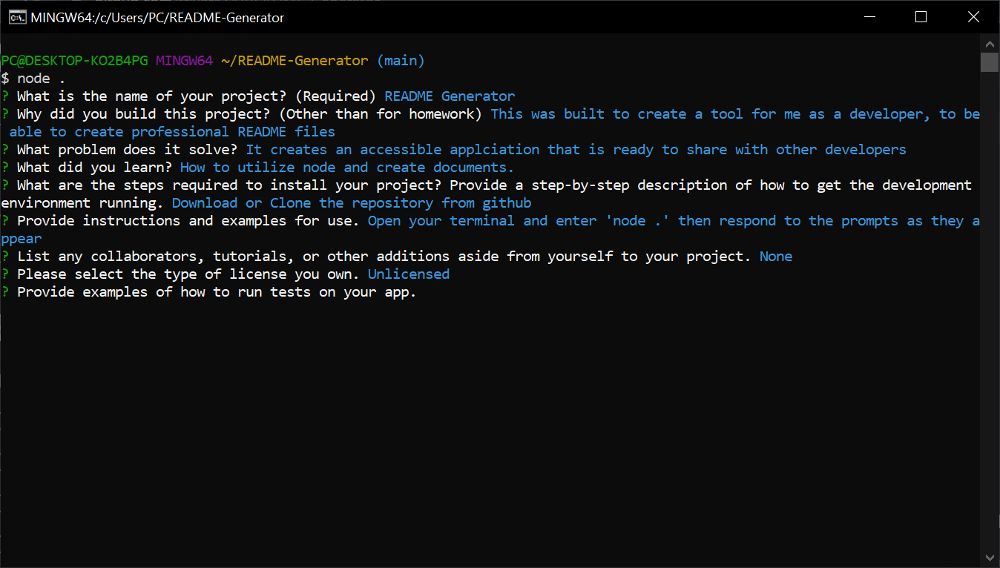

# README Generator
## Description
  
- Reason behind the project: This was built to create a tool for me as a developer, to be able to create professional README files
- Purpose or Problem Solved: It creates an accessible applciation that is ready to share with other developers
- Important information learned: How to utilize node and create documents.
  
## Table of Contents (Optional)
  
- [Installation](#installation)
- [Usage](#usage)
- [Credits](#credits)
- [License](#license)
- [Tests](#tests)
- [Questions](#questions)
  
## Installation

Download or Clone the repository from github

## Usage
  
Open your terminal and enter 'node .' then respond to the prompts as they appear

Screenshot attatched
  

  
## Credits
  
Collaborators: None 
  
## License
  
Unlicensed

## Tests
  
No tests
  
## Questions
  
All questions and communications can be directed to:
Github: github.com/frivera14 
