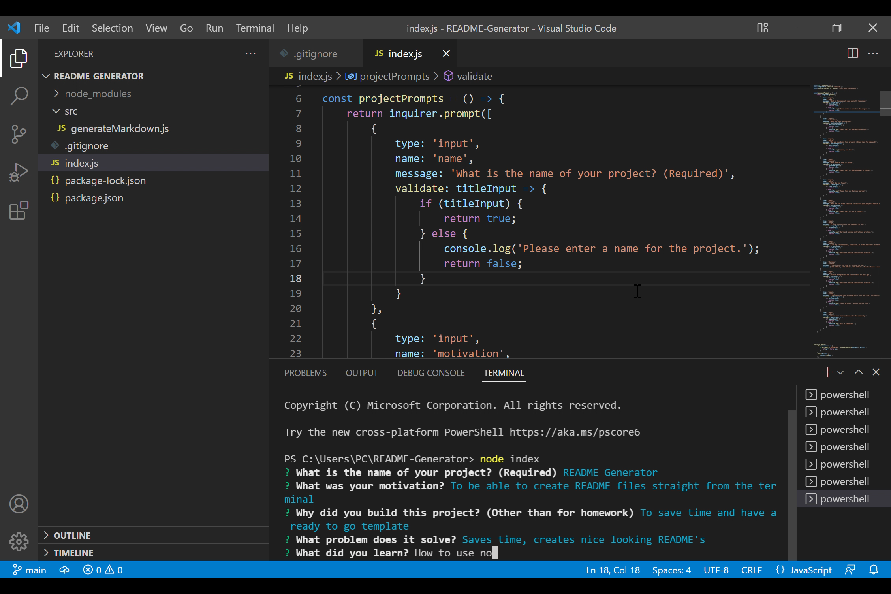

# README Generator
## Description
  
- What was the motivation? To be able to create README files straight from the terminal
- Why did I build this project? To save time and have a ready to go template
- What problem does it solve? Saves time, creates nice looking README's
- What did I learn? How to use node and new functions
  
## Table of Contents (Optional)
  
- [Installation](#installation)
- [Usage](#usage)
- [Credits](#credits)
- [License](#license)
- [Tests](#tests)
- [Questions](#questions)
  
## Installation

Follow github link, download zip file or clone repo

## Usage
  
Run 'node index' on your terminal

Demo here: https://youtu.be/eooTdfX5wJI

  

  
## Credits
  
Collaborators: No collaborators 
  
## License
  
Unlicensed

## Tests
  
undefined
  
## Questions
  
All questions and communications can be directed to:
Github: github.com/frivera14 
Email: kikridu@gmail.com
